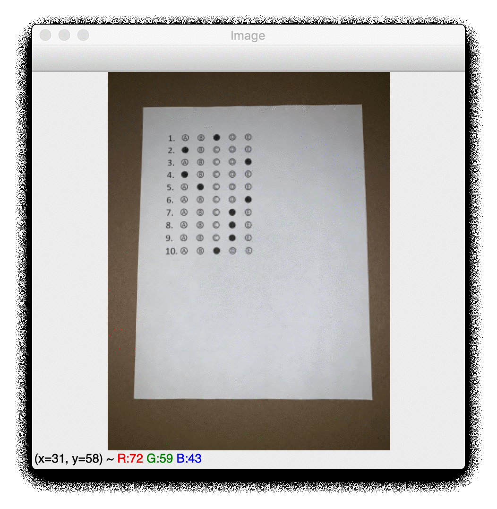

# Use Computer Vision to Test Your Friends’ NCAA Tournament Knowledge
## Grading a bubble quiz with Optical Mark Recognition

You can try out the app at https://bubble-grader.onrender.com/.
A Medium post summarizing the steps in this project can be found [here](https://medium.com/@chrispmaag/use-computer-vision-to-test-your-friends-ncaa-tournament-knowledge-46f7dc7b1ae).

## Sample results from the app

## Credit

This project was inspired by Adrian Rosebrock’s blog and code that can be found [here](https://www.pyimagesearch.com/2016/10/03/bubble-sheet-multiple-choice-scanner-and-test-grader-using-omr-python-and-opencv/). The web app is based on materials from Jeremy Howard's fastai [deep learning course](http://course.fast.ai/ "Fastai").

## Packages

This project primarily uses OpenCV for its numerous computer vision functions.

## Motivation

My goal was to create a web app that could grade a bubble quiz, enabling me to test my friends' knowledge in a fun way.

## Files

The three main files are:

- **test_grader_final.py**, which is a heavily commented program designed to make understanding opencv's functions simple. It analyzes an image passed in from the command line and prints out numerous checkpoints along the way
- **app/server.py**, which sets up the web app and encodes the graded quiz image to pass to the front end. It's based on test_grader_final.py, but is designed to allow input from a phone
- **app/static/client.js**, which sets the image source of the html page to the graded quiz image

## Results

### How does it work?

1. Find the outline (contour) of the bubble page. Transform the image so it is a top-down view of the page.
2. Threshold the image, then find new contours for all the bubbles.
3. Sort the remaining contours (should be 50 for 10 questions with 5 bubbles each) from top to bottom based on their y position on the page.
4. Next, go through the list of contours in chunks of 5 (for the number of options on each question), and sort them from left to right based on their x position.
5. Figure out which bubble is filled in and check to see if it matches the answer sheet.

### What I added to the original blog post

- Used multiple thresholding techniques, with preference to cv2.adaptiveThreshold, which seemed to give better results for me on photos with variable lighting conditions (shadows or different levels of brightness)
- More robust filtering of bubbles using cv2.contourArea. This dramatically improved my results on the 20 question quiz by eliminating confusion with the numbers before the bubbles
- Ability to use your phone as the input device for the image (rather than relying on knowing the path of a file and passing in command line arguments)
- Grade a larger number of questions by using more realistic bubble sizes
- Heavily commented the code for easier comprehension of the various OpenCV functions used
